<!-- Please do not change this logo with link -->
<a target="_blank" href="https://www.microchip.com/" id="top-of-page">
   <picture>
      <source media="(prefers-color-scheme: light)" srcset="images/logos/mchp_logo_light.png" width="350">
      <source media="(prefers-color-scheme: dark)" srcset="images/logos/mchp_logo_dark.png" width="350">
      
   </picture>
</a>

# SPI Driver Using the AVR16EB32 Microcontroller and MCC Melody
This code example demonstrates how to communicate as host and client using the Serial Peripheral Interface (SPI) protocol in Interrupt and Polling modes on a AVR16EB32 microcontroller with MPLAB® Code Configurator (MCC) Melody. The [SPI Host demo](#spi-host-demonstration) writes data to a seven-segment display upon the press of a hardware button. The [SPI Client demo](#spi-client-demonstration) exchanges data between two AVR16EB32 microcontrollers and displays the exchanged data on a serial terminal.

## Related Documentation
- [SPI Release Notes](https://onlinedocs.microchip.com/v2/keyword-lookup?keyword=MCC.MELODY.SCF-AVR8-SPI-V1.RELEASENOTES&version=latest&redirect=true)
- [AVR® EB Product Family Page](https://www.microchip.com/en-us/products/microcontrollers-and-microprocessors/8-bit-mcus/avr-mcus/avr-eb)

## Software Used
- [MPLAB® X IDE v6.15 or newer](http://www.microchip.com/mplab/mplab-x-ide)
- [MPLAB® XC8 Compiler v2.45 or newer](https://www.microchip.com/en-us/tools-resources/develop/mplab-xc-compilers/xc8)
- [MPLAB® Code Configurator (MCC) v5.4.1 or newer](https://www.microchip.com/en-us/tools-resources/configure/mplab-code-configurator)

## Hardware Used
- [AVR16EB32 Curiosity Nano](https://www.microchip.com/en-us/development-tool/EV73J36A)
- [Curiosity Nano Base for Click boards™](https://www.microchip.com/Developmenttools/ProductDetails/AC164162)
- [7Seg Click](https://www.mikroe.com/7seg-click)

## [SPI Host Demonstration](#spi-host-demonstration)
### [Setup for Host Demo](#setup-for-host-demo)
1. Download the ZIP file containing the source code and extract it.
2. Connect the 7seg Click board to Curiosity Nano Base on mikroBUS™ port 1.
3. Connect the Curiosity Nano board to the Curiosity Nano Base.
4. Connect the Curiosity Nano board to the system.
5. Open MPLAB X IDE.
6. Click _File>Open Project_.
7. Navigate to the extracted source code folder and select both projects with `spi-host` in the project names.
8. Click the **Open Project** button in the window.
    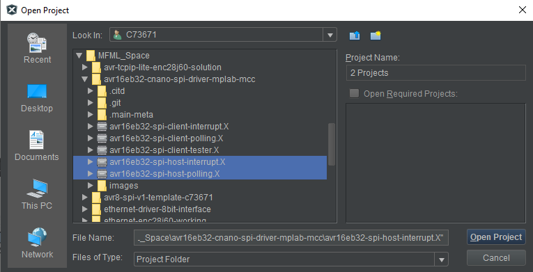
9.  The following configuration was made in MCC Melody UI for SPI Host Driver polling project with Interrupt Driven toggled on for the interrupt project:
    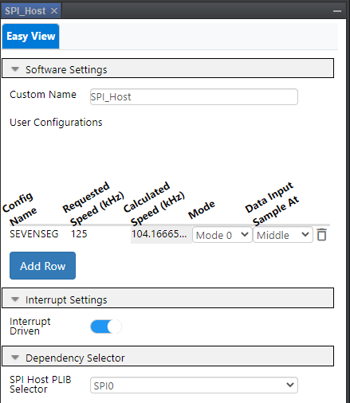
10. The following pin configurations were made in MCC Melody UI for both SPI Host Driver projects:
    

### Operation: Host Polling
1. From the Projects window on MPLAB, right click the `avr16eb32-spi-host-polling` project and select Make and Program Device to program the code to the device.
    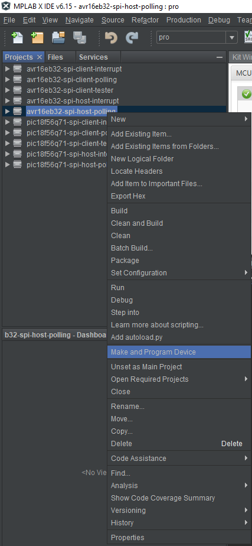
2. A dialog box will pop up to select the tool to be programmed. Select the connected tool from the drop-down box. Click **OK**.
    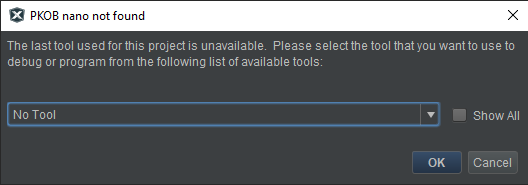
3. The seven-segment display will now show `--` once the programming is complete.
4. Press SW0 on the Curiosity Nano. The display will now show `00`.
5. Press SW0 again to increment the number showed on the seven-segment display.

### Operation: Host Interrupt
1. From the Projects window on MPLAB, right click the `avr16eb32-spi-host-interrupt` project and select Make and Program Device to program the code to the device.
    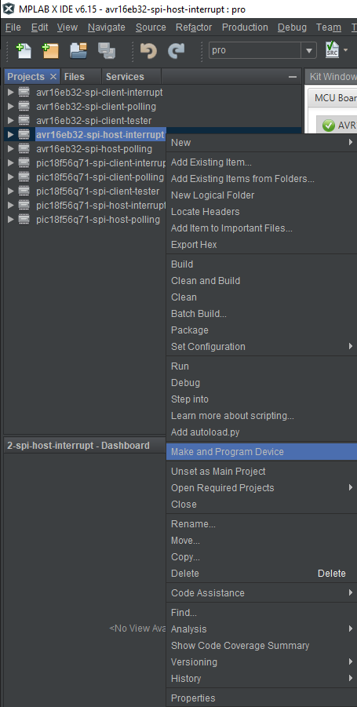
2. A dialog box will pop up to select the tool to be programmed. Select the connected tool from the drop-down box. Click **OK**.
    
3. The seven-segment display will now show `--` once the programming is complete.
4. Press SW0 on the Curiosity Nano. The display will now show `00`.
5. Press SW0 again to increment the number showed on the seven-segment display.

## [SPI Client Demonstration](#spi-client-demonstration)
### [Setup for Client Demo](#setup-for-client-demo)
1. Download the ZIP file containing the source code and extract it.
2. Connect the Host Data Output (MOSI), Host Data Input (MISO), Serial Clock (SCK), Chip Select 1 (CS1) and Ground (GND) pins of two Curiosity Nano boards to each other.
   The following pinouts are required for the AVR16EB32 demonstration:
   
   | Pin Function | Hardware Pin |
   | ------------ | ------------ |
   | MOSI         | PA4          |
   | MISO         | RA5          |
   | SCK          | RA6          |
   | CS1          | RA7          |
   | GND          | GND          |
3. Open MPLAB X IDE.
4. Click _File>Open Project_.
5. Navigate to the extracted source code folder and select all three projects with `spi-client` in the project names.
6. Click the **Open Project** button in the window.
    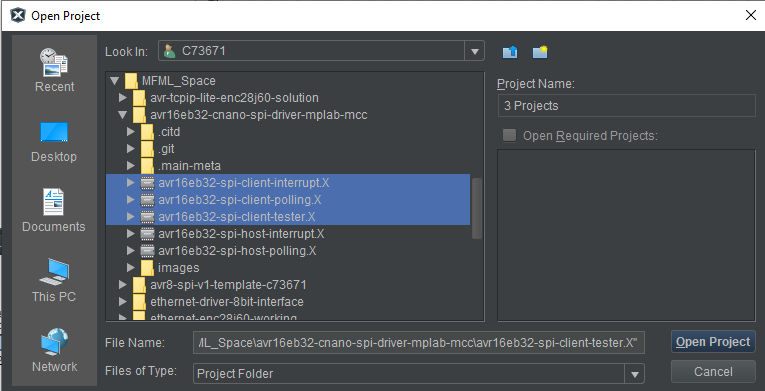
7. Connect one development board to the system. Make note of the serial number on the back of the development board.
8.  From the Projects window on MPLAB, right click the `avr16eb32-spi-client-tester` project and select Make and Program Device to program the code to the device.
    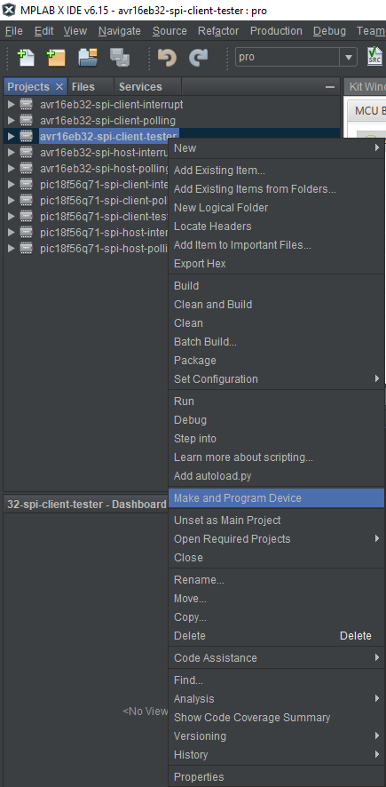
9.  A dialog box will pop up to select the tool to be programmed. Select the connected tool from the drop-down box. Click **OK**.
    
10. After programming the device, the on-board LED0 will flash once every second indicating that it is working as expected. The setup for testing client projects is now complete. Disconnect the tester for now. The `spi-client-polling` and `spi-client-interrupt` projects are preconfigured as mentioned in the next two points.
11. The following configuration was made in MCC Melody UI for SPI Client Driver polling project with Interrupt Driven toggled on for the interrupt project:
    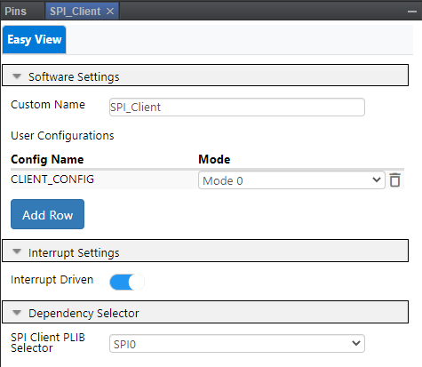
12. The following pin configurations were made in MCC Melody UI for both SPI Client Driver projects:
    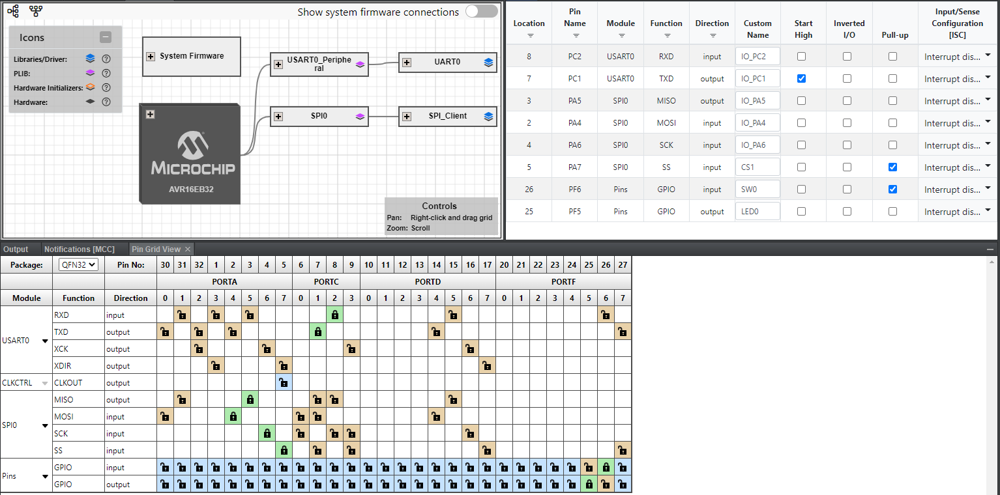

### Operation: Client Polling
1. Open MPLAB Data Visualizer from the toolbar above. Alternatively, go to _Window>Debugging>Data Visualizer_.
2. Hover the cursor over the COM port of the device just connected and select the option Display as Text in the Terminal.
    
3. Now connect the tester development board used in [Setup for Client Demo](#setup-for-client-demo) to the system. The client tester will start working automatically.
4. From the Projects window on MPLAB, right click the `avr16eb32-spi-client-polling` project and select Make and Program Device to program the code to the device.
    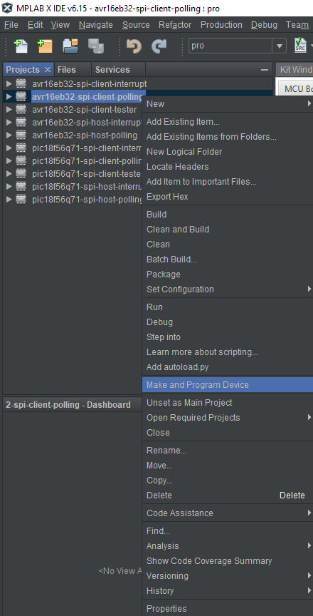
5. A dialog box will pop up to select the tool to be programmed. From the drop-down box select a different tool from the one selected before in [Setup for Client Demo](#setup-for-client-demo). The serial number can be found on the back of the development board. Click **OK**.
    
6. Once the programming is complete, the terminal window in Data Visualizer will display the results. If the data exchange happens as expected, `SUCCESS` will be displayed in the terminal. See the example below:
    

### Operation: Client Interrupt
1. Open MPLAB Data Visualizer from the toolbar above. Alternatively, go to _Window>Debugging>Data Visualizer_.
2. Hover the cursor over the COM port of the device just connected and select the option Display as Text in the Terminal.
    
3. Now connect the tester development board used in [Setup for Client Demo](#setup-for-client-demo) to the system. The client tester will start working automatically.
4. From the Projects window on MPLAB, right click the `avr16eb32-spi-client-interrupt` project and select Make and Program Device to program the code to the device.
    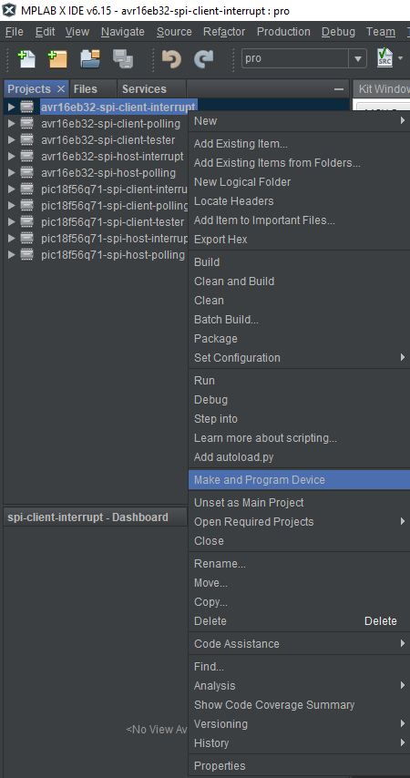
5. A dialog box will pop up to select the tool to be programmed. From the drop-down box select a different tool from the one selected before in [Setup for Client Demo](#setup-for-client-demo). The serial number can be found on the back of the development board. Click **OK**.
    
6. Once the programming is complete, the terminal window in Data Visualizer will display the results. If the data exchange happens as expected, `SUCCESS` will be displayed in the terminal. See the example below:
    

## Summary
The demo provides examples of both host and client communication using the SPI protocol in Interrupt and Polling modes of operation. The demo utilizes firmware code generated using MCC Melody.